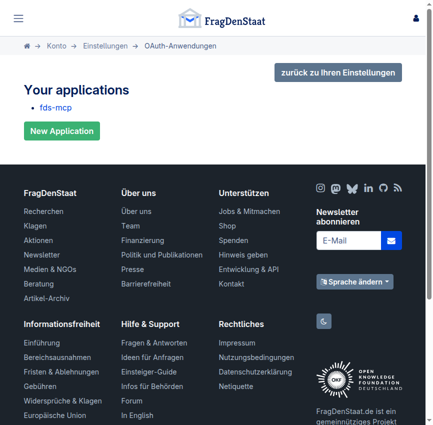
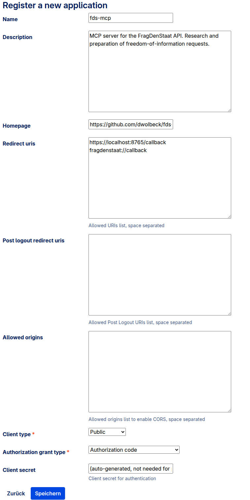
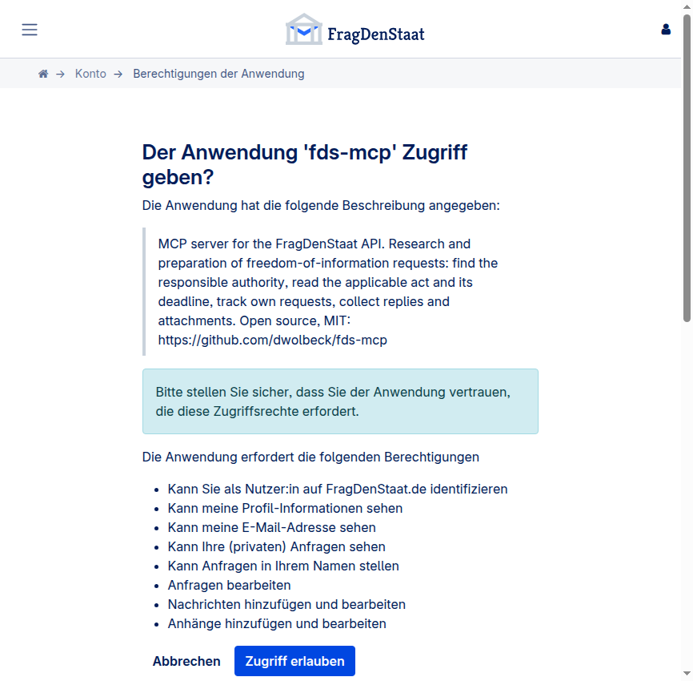

# OAuth setup

`fds-mcp` talks to fragdenstaat.de as **you**. There is no service account and no simple
API key: the only programmatic path is an OAuth 2.0 application registered on your own
account.

Everything below was walked through on a live account on 2026-09-05, including the
mistakes.

---

## 1. Register an application

Go to **<https://fragdenstaat.de/account/applications/>** while logged in. All account
pages are protected by `recent_auth_required`, so an old session is not enough — you will
be asked for your password again.



Click *Neue Anwendung* / *Register new application*:



| Field | Value | Why |
|---|---|---|
| **Name** | `fds-mcp` | shown on the consent screen |
| **Description** | anything | shown on the consent screen |
| **Homepage** | your fork or `https://github.com/dwolbeck/fds-mcp` | |
| **Redirect URIs** | `https://localhost:8765/callback`<br>`fragdenstaat://callback` | one per line; register **both** — see step 3 |
| **Client type** | `Public` | forces PKCE and makes the client secret irrelevant |
| **Authorization grant type** | `Authorization code` | the only flow that works for user data |
| Post-Logout Redirect URIs | *empty* | |
| Allowed Origins | *empty* | |

### Redirect URI rules — read this before you get a form error

`OAUTH2_PROVIDER.ALLOWED_REDIRECT_URI_SCHEMES` on fragdenstaat.de is
`["https", "fragdenstaat"]`. Consequences:

- **`http://localhost:...` is rejected.** The usual local-development redirect does not work.
- `https://localhost:8765/callback` is accepted — the scheme is checked, not the host.
- `fragdenstaat://callback` is accepted as a private-use scheme.

### Client type: pick `Public`

With `Public`, `is_pkce_required()` returns true and the flow is protected by PKCE
(S256). The form still generates a client secret, but fragdenstaat.de stores only a hash
of it and public clients never send it. That removes the entire question of where to keep
a secret — there is nothing to keep.

Choose `Confidential` only for a server-side deployment where you can protect the secret.

## 2. Store the client data

```bash
fds-mcp configure \
  --client-id <your client id> \
  --redirect-uri "https://localhost:8765/callback"
```

That takes the default scopes — `read:user read:request make:request` — which is
everything the tools in this repository actually call. Written to
`~/.config/fds-mcp/config.json` with mode `0600`.

### Scopes

**Grant the least you need.** A token is only as dangerous as its scopes, it lives for
180 days, and it sits in a file that an MCP server reads on every call. Read-only usage
needs `read:user read:request`; drop `make:request` and `submit_request` can never fire,
whatever happens to the five gates.

Do **not** add `write:request`, `write:message` or `write:attachment` "to be safe": no
tool in this repository uses them (documenting postal mail is listed as a known
limitation, not as a feature), so they would grant a capability nothing here needs. Add
them only when you are building on top of this server and know why.

| Scope | Needed for |
|---|---|
| `read:user` | `whoami`, knowing which account you are |
| `read:profile`, `read:email` | richer `/api/v1/user/` response, optional |
| `read:request` | `list_my_requests`, `get_request` on non-public requests |
| `make:request` | `submit_request`, and the request viewset at all |
| `write:request` | *not used by this server.* `POST /api/v1/message/` calls `validate_request` → `can_write_foirequest()`, and `PATCH /request/{id}/` needs it on top of `make:request` — relevant only if you extend the server |
| `write:message` | *not used by this server.* documenting postal correspondence |
| `write:attachment` | *not used by this server.* uploads via the tus endpoint |

The screenshot of the consent screen further down was taken while trying out the full
scope list; it therefore shows more permissions than `fds-mcp configure` asks for by
default. Yours should be shorter.

## 3. Log in

```bash
fds-mcp login
```

This starts a local HTTPS listener on port 8765, opens the browser, and waits for the
callback.



The consent screen lists exactly the scopes you configured. Approve, and the tokens land
in `~/.config/fds-mcp/tokens.json`, mode `0600`.

### When the HTTPS listener does not work

The listener uses a self-signed certificate, so the browser shows
`NET::ERR_CERT_AUTHORITY_INVALID` and blocks the redirect. In a normal browser you click
*Advanced → Proceed to localhost*. In a locked-down or automated browser you may not be
able to, and `fds-mcp login` then times out with
`No OAuth callback received within 300s.`

Use manual mode instead — it needs no listener and no certificate:

```bash
fds-mcp configure --client-id <id> --redirect-uri "fragdenstaat://callback" --scopes "..."
fds-mcp login --manual
```

After approving, the browser tries to open `fragdenstaat://callback?code=...&state=...`
and fails, because no application is registered for that scheme. **That failure is the
expected outcome.** Copy the whole URL out of the address bar and paste it back into the
prompt. This is why step 1 registers both redirect URIs: you can switch between them
without touching the application.

## 4. Verify

```bash
fds-mcp whoami
fds-mcp status
```

`status` prints the client id, the redirect URI, the granted scopes, whether tokens are
valid, and the current state of the local throttle ledger. It never prints a token.

## Token lifetime

Refresh tokens are valid for **180 days**
(`OAUTH2_PROVIDER.REFRESH_TOKEN_EXPIRE_SECONDS`). `fds-mcp` refreshes automatically as
long as you use it within that window. After that, run `fds-mcp login` again.

`fds-mcp logout` deletes the stored tokens locally. To revoke access on the server, use
<https://fragdenstaat.de/account/authorized-tokens/>; to delete the application entirely,
use its page under <https://fragdenstaat.de/account/applications/>.

## What is stored where

| File | Mode | Content |
|---|---|---|
| `~/.config/fds-mcp/config.json` | 0600 | client id, redirect URI, scopes. No secret for public clients. |
| `~/.config/fds-mcp/tokens.json` | 0600 | access token, refresh token, expiry, granted scopes |
| `~/.config/fds-mcp/callback-{cert,key}.pem` | 0600 | self-signed certificate for the local listener, generated on first `login` |

None of these belong in version control. The shipped `.gitignore` covers them, but they
live outside the repository anyway.
